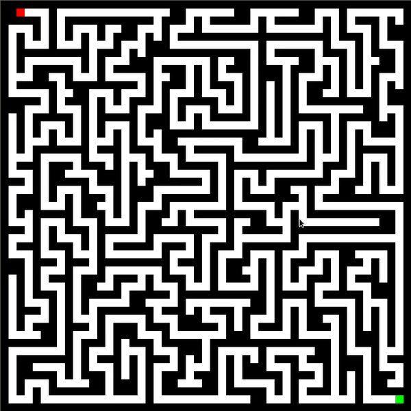

# A\* Search Algorithm Visualization

<p align="center">
  
</p>


## Usage
Install `pygame` if you haven't already.
```
pip install pygame
````

Run it.
```
python main.py
```

### Controls
- `r` to reset the maze and sleeping time
- `<space>` to search for the shortest path
- `d` enable diagonal movement'
- `+` to increase the sleeping time
- `-` to decrease the sleeping time
- `q` to quit
